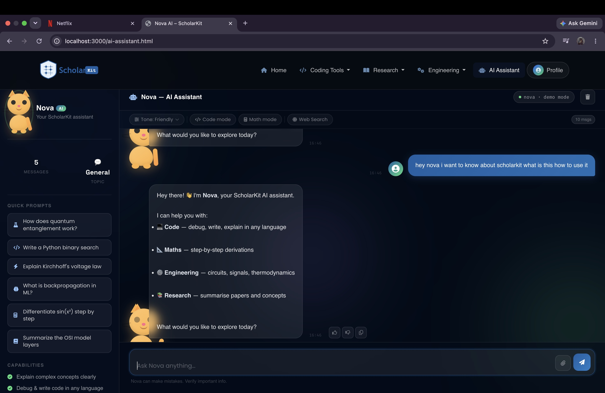

<div align="center">

# 🎓 ScholarKit

### *Where Teams Learn, Plan, and Build Together with AI*

[](https://hackerearth.com)
[](https://hackerearth.com)
[](https://hackerearth.com)
[](https://azure.microsoft.com)
[](https://nodejs.org)
[](https://getbootstrap.com)

<br/>

> **Every student knows the panic — exams are around the corner, your group chat is a mess, nobody agrees on what to study, and half the team is still looking for good resources at midnight. ScholarKit was built to fix exactly that.**

<br/>



<br/>

[🚀 Live Demo](https://scholarkit1.netlify.app) · [🤖 Try Nova](https://scholarkit1.netlify.app/ai-assistant.html) · [📊 View Insights](https://scholarkit1.netlify.app/nova_insights.html) · [⚔️ Code Combat](https://scholarkit1.netlify.app/codegame.html)

</div>

---

## 📋 Table of Contents

- [About ScholarKit](#-about-scholarkit)
- [The Problem We Solve](#-the-problem-we-solve)
- [Features](#-features)
  - [Nova AI Assistant](#-nova-ai-assistant)
  - [Team Study Planner](#-team-study-planner)
  - [Nova Insights Dashboard](#-nova-insights-dashboard)
  - [Coding Tools Hub](#-coding-tools-hub)
  - [Research Hub](#-research-hub)
  - [Engineering Tools](#-engineering-tools)
  - [Code Combat Game](#-code-combat-game)
- [Tech Stack](#-tech-stack)
- [Architecture](#-architecture)
- [Project Structure](#-project-structure)
- [Getting Started](#-getting-started)
- [Environment Variables](#-environment-variables)
- [Deployment](#-deployment)
- [Hackathon Details](#-hackathon-details)
- [Screenshots](#-screenshots)
- [Contributing](#-contributing)
- [License](#-license)

---

## 🌟 About ScholarKit

ScholarKit is an **AI-powered all-in-one platform** built for student teams who are done with the chaos of group studying. It combines intelligent planning, real-time AI assistance, gamified learning, and curated academic resources — all in one seamlessly designed dark-themed web app.

At its core is **Nova**, an AI assistant powered by **GPT-4o Mini via Microsoft Azure AI (GitHub Models)**. Nova doesn't just answer questions — she browses the web, helps debug code, solves math derivations step by step, and builds custom study plans for your entire team.

Whether you're prepping for board exams, pushing through a hackathon sprint, or just trying to keep your study group on track — ScholarKit is the teammate that never sleeps, never panics, and always has a plan.

### 🏆 Built For

> **Microsoft Build AI 2026 Hackathon** on HackerEarth
> Theme: *AI at Work: Productivity & Teamwork Reimagined*

---

## ❌ The Problem We Solve

Student teams face a set of deeply frustrating problems that haven't been solved together in one place:

| Problem | Reality |
|---------|---------|
| 📅 **No Study Coordination** | Teams waste hours trying to align schedules, subjects, and deadlines across noisy group chats |
| 🔍 **Resource Overload** | Students drown in search results but can't find quality, exam-relevant material fast |
| 🤖 **No Instant AI Help** | When stuck at 11pm the night before an exam, there's no intelligent academic assistant available |
| 🛠️ **Tool Fragmentation** | Compilers, docs, formatters, research — students jump between 8+ tabs just to get work done |
| 📊 **No Progress Visibility** | Teams have no way to track how well everyone is studying or where they're falling behind |
| ⚡ **Low Engagement** | Studying is boring — there's nothing making it feel rewarding or competitive |

ScholarKit solves all six with one unified platform.

---

## ✨ Features

### 🤖 Nova AI Assistant

Nova is ScholarKit's flagship feature — a full-featured AI academic assistant built on **GPT-4o Mini via Microsoft Azure AI Inference**.

**Capabilities:**
- 💬 **Multi-turn conversation** — Nova remembers context across your chat session
- `</>` **Code Mode** — Write, debug, explain, and review code in any programming language
- **∑ Math Mode** — Step-by-step derivations, equation solving, calculus, and more
- 🌐 **Web Search** — Nova can browse real URLs and summarize live web content
- 🎛️ **Tone Selector** — Switch between Friendly, Academic, and Concise modes
- ⚡ **Quick Prompts** — Pre-built academic starters like:
  - *"How does quantum entanglement work?"*
  - *"Write a Python binary search"*
  - *"Explain Kirchhoff's voltage law"*
  - *"What is backpropagation in ML?"*
  - *"Differentiate sin(x²) step by step"*
- 👍👎 **Feedback system** — Rate Nova's responses
- 📋 **Copy to clipboard** — One-click copy of any response
- 🔢 **Message counter** — Tracks your session usage

**How it works:**
The frontend sends your message to a Node.js proxy server, which forwards the request to `models.inference.ai.azure.com` using your GitHub Personal Access Token. The response streams back and renders in Nova's chat UI.

```
User Input → ai.js → POST /api/chat → server.js → Azure AI Inference → GPT-4o Mini → Response
```

---

### 📅 Team Study Planner

The Team Study Planner is what makes ScholarKit unique. It's the **first AI study planner built for groups** — not just individuals.

**How to use it:**

1. **Enter your subjects** — Add subjects with exam dates and daily study hours
2. **Add team members** — Enter names for coordinated team planning (or go solo)
3. **Set preferences** — Choose study intensity, available days, and difficulty preference
4. **Generate Plan** — Nova builds a complete, day-by-day study schedule for your whole team

**What you get:**
- 📆 A full day-by-day schedule from today to your exam date
- 👤 Sessions tagged and assigned to specific team members
- ⚡ Difficulty ratings: **Light / Moderate / Challenging**
- 📎 Real curated resource links (NCERT, Khan Academy, YouTube, etc.)
- 🏠 Day type labels: **School Day / Holiday / Rest**
- 📊 Summary metrics: total study hours, subjects covered, team size, exam countdown
- 🔄 Regenerate anytime with different parameters

**Team mode features:**
- Member avatars with color-coded initials
- Sessions assigned per member with emoji tags
- Shared team banner showing all members at a glance
- Coordination banner confirming Nova's team-wide plan

---

### 📊 Nova Insights Dashboard

The Insights page gives your team visibility into study patterns, progress, and performance.

**Features:**
- 📈 Study session activity charts
- 🧠 Topic completion tracking
- 📅 Calendar view of planned vs completed sessions
- 🏅 Performance summaries and recommendations
- 👥 Team-level vs individual breakdowns

---

### 🛠️ Coding Tools Hub

A one-stop coding workspace so developers never need to leave ScholarKit.

| Tool | Provider | What it does |
|------|----------|--------------|
| 🖥️ Online Compiler | OneCompiler | Run code in 60+ languages |
| ✨ Code Formatter | Prettier | Format and beautify code instantly |
| 🔍 RegEx Tester | Regex101 | Test & explain regular expressions |
| 📚 DevDocs | DevDocs.io | Offline-ready API documentation |
| ❓ Stack Overflow | Stack Overflow | Quick community search |
| 📖 MDN Web Docs | MDN | HTML, CSS, JS reference |
| 🐙 GitHub | GitHub | Repository & version control |
| 🐍 Python Docs | Python.org | Official Python documentation |

All tools open in a seamlessly integrated view — no hunting through bookmarks.

---

### 📚 Research Hub

A curated academic research library for students who want to go deeper.

**Features:**
- 🏷️ Filter papers by topic: **AI · ML · NLP · Computer Vision · Bioinformatics**
- 🌟 Featured research with full abstract previews
- 👤 Author chips with institution metadata
- 📅 Publication year, citation count, and journal badges
- 🔗 Direct links to arXiv, IEEE, ACM, and more
- 🔎 Search bar for quick paper discovery
- 📊 Research stats: papers indexed, topics covered, active researchers

---

### ⚙️ Engineering Tools

A dedicated hub for engineering students covering technical calculators and references.

**Topics covered:**
- ⚡ Electronics & Circuits
- 📡 Signals & Systems
- 🌡️ Thermodynamics
- 🔧 Mechanical Engineering
- 🧮 Engineering Mathematics
- 🏗️ Civil & Structural

---

### ⚔️ Code Combat Game

Learning shouldn't always feel like work. Code Combat is a **gamified coding quiz battle** built into ScholarKit.

**How it works:**
- You play as a hero battling a monster
- Answer coding questions correctly → **Attack the monster** 💥
- Answer incorrectly → **The monster attacks you** 💔
- Clear all rounds to win; lose all HP and it's game over

**Game modes:**
| Mode | Rounds | Questions per Round |
|------|--------|---------------------|
| 🟢 Easy | 3 | 3 |
| 🟡 Normal | 4 | 4 |
| 🔴 Hard | 5 | 5 |

**Features:**
- Animated battle canvas (hero vs monster)
- HP bars for both hero and monster
- Round progress dots
- Score tracking
- Timer per question
- Feedback bar showing correct/wrong answers
- Victory and defeat overlays with stats

---

## 🧰 Tech Stack

### Frontend
| Technology | Purpose |
|------------|---------|
| **HTML5** | Page structure and semantics |
| **CSS3** | Custom dark-theme styling |
| **Vanilla JavaScript** | Interactivity and API calls |
| **Bootstrap 5.3** | Responsive layout and components |
| **Font Awesome 6.5** | Icons throughout the UI |
| **Google Fonts** | DM Sans, Syne, JetBrains Mono, Poppins, Orbitron |

### Backend
| Technology | Purpose |
|------------|---------|
| **Node.js** | Proxy server runtime |
| **http / https** | Built-in Node modules for requests |
| **dotenv** | Environment variable management |

### AI & Cloud
| Technology | Purpose |
|------------|---------|
| **Microsoft Azure AI Inference** | AI API endpoint |
| **GitHub Models** | Free-tier access to GPT-4o Mini |
| **GPT-4o Mini** | Powers Nova's responses |
| **Web Browse Route** | Custom URL fetcher for Nova's web search |

### Deployment
| Platform | Purpose |
|----------|---------|
| **Netlify** | Frontend static hosting |
| **Render** | Backend Node.js server hosting |
| **GitHub** | Version control and source code |

---

## 🏗️ Architecture

```
┌─────────────────────────────────────────────────────────────┐
│                        SCHOLARKIT                           │
│                                                             │
│  ┌──────────────┐      ┌──────────────┐                    │
│  │   Frontend   │      │   Nova AI    │                    │
│  │              │      │   Panel      │                    │
│  │  index.html  │      │              │                    │
│  │  ai-assist.  │      │  ai.js       │                    │
│  │  research    │      │  app.js      │                    │
│  │  engineering │      │              │                    │
│  └──────┬───────┘      └──────┬───────┘                    │
│         │                     │                             │
│         └──────────┬──────────┘                             │
│                    │                                        │
│                    ▼                                        │
│           ┌────────────────┐                               │
│           │  Node.js Proxy │                               │
│           │   server.js    │                               │
│           │                │                               │
│           │  POST /api/chat│                               │
│           │  POST /api/    │                               │
│           │  browse        │                               │
│           └────────┬───────┘                               │
│                    │                                        │
└────────────────────┼────────────────────────────────────────┘
                     │
                     ▼
        ┌────────────────────────┐
        │  Microsoft Azure AI    │
        │  Inference Endpoint    │
        │                        │
        │  models.inference.     │
        │  ai.azure.com          │
        └────────────┬───────────┘
                     │
                     ▼
           ┌──────────────────┐
           │   GPT-4o Mini    │
           │  (GitHub Models) │
           └──────────────────┘
```

**Request Flow:**
```
1. User types message in Nova chat
2. ai.js sends POST request to /api/chat
3. server.js forwards to Azure AI Inference with GitHub Token
4. GPT-4o Mini processes the request
5. Response returns through the proxy
6. Nova renders the reply in the chat UI
```

**Browse Flow:**
```
1. Nova detects a URL in the conversation
2. Frontend sends POST to /api/browse with { url: "..." }
3. server.js fetches the page, strips HTML tags
4. Returns clean text (max 8000 chars) to Nova
5. Nova summarizes the content in her response
```

---

## 📁 Project Structure

```
scholarkit/
│
├── 📄 index.html              # Main landing page
├── 📄 ai-assistant.html       # Nova AI chat interface
├── 📄 nova_insights.html      # Study insights dashboard
├── 📄 research.html           # Research papers hub
├── 📄 engineering.html        # Engineering tools hub
├── 📄 about.html              # About ScholarKit
├── 📄 profile.html            # User profile page
├── 📄 codegame.html           # Code Combat game
│
├── 🎨 style.css               # Main stylesheet (index)
├── 🎨 style3.css              # Research page styles
├── 🎨 style4.css              # Engineering page styles
├── 🎨 style5.css              # Additional styles
├── 🎨 gamestyle.css           # Code Combat styles
│
├── ⚙️  app.js                  # Core app logic + Nova widget
├── ⚙️  ai.js                   # Nova AI chat logic
├── ⚙️  research.js             # Research page functionality
├── ⚙️  engg.js                 # Engineering page logic
├── ⚙️  game.js                 # Code Combat game logic
│
├── 🖥️  server.js               # Node.js proxy server
├── 📦 package.json            # Node dependencies
├── 🔒 .env.example            # Environment variable template
├── 🚫 .gitignore              # Files to exclude from git
│
├── 🖼️  logo.svg               # ScholarKit logo
├── 🖼️  img.jpg                # Background image
└── 📖 README.md               # This file
```

---

## 🚀 Getting Started

### Prerequisites

Make sure you have the following installed:
- [Node.js](https://nodejs.org) v16 or higher
- [npm](https://npmjs.com) v7 or higher
- A [GitHub Personal Access Token](https://github.com/settings/tokens) with access to GitHub Models

### 1. Clone the Repository

```bash
git clone https://github.com/yourusername/scholarkit.git
cd scholarkit
```

### 2. Install Dependencies

```bash
npm install
```

### 3. Set Up Environment Variables

```bash
cp .env.example .env
```

Open `.env` and add your GitHub token:

```env
GITHUB_TOKEN=ghp_your_personal_access_token_here
```

> 💡 **How to get a GitHub Token:**
> 1. Go to [github.com/settings/tokens](https://github.com/settings/tokens)
> 2. Click **Generate new token (classic)**
> 3. Give it a name like `scholarkit-nova`
> 4. No special scopes needed for GitHub Models
> 5. Copy the token and paste it in your `.env`

### 4. Start the Server

```bash
node server.js
```

You should see:

```
🚀 Nova is live — Powered by Microsoft GitHub Models!
🤖 Model: gpt-4o-mini (via Azure AI)
👉 Open: http://localhost:3000/ai-assistant.html
```

### 5. Open in Browser

The server will automatically open your browser. Or navigate to:

```
http://localhost:3000
```

---

## 🔐 Environment Variables

| Variable | Required | Description |
|----------|----------|-------------|
| `GITHUB_TOKEN` | ✅ Yes | Your GitHub Personal Access Token for GitHub Models (Azure AI) |
| `PORT` | ❌ Optional | Server port (defaults to `3000`) |

> ⚠️ **Never commit your `.env` file.** It contains your secret token. The `.gitignore` already excludes it.

---

## 🌐 Deployment

### Frontend — Netlify

1. Push your project to GitHub
2. Go to [netlify.com](https://netlify.com) → **New site from Git**
3. Connect your GitHub repo
4. Set **Publish directory** to `/` (root)
5. Click **Deploy**

Your frontend will be live at a `*.netlify.app` URL.

### Backend — Render

Nova's AI requires a running Node.js server. Deploy it free on Render:

1. Go to [render.com](https://render.com) → **New Web Service**
2. Connect your GitHub repo
3. Configure:

| Setting | Value |
|---------|-------|
| **Build Command** | `npm install` |
| **Start Command** | `node server.js` |
| **Environment** | `Node` |

4. Under **Environment Variables**, add:
   - `GITHUB_TOKEN` = your token

5. Click **Deploy**

6. Once live, copy your Render URL (e.g. `https://scholarkit-api.onrender.com`)

### Connect Frontend to Backend

In your `ai.js` file, update the API endpoint:

```javascript
// Change this:
const API_URL = '/api/chat';

// To this:
const API_URL = 'https://scholarkit-api.onrender.com/api/chat';
```

Redeploy on Netlify and Nova will be fully live! 🎉

---

## 🏆 Hackathon Details

| Detail | Info |
|--------|------|
| **Event** | Microsoft Build AI 2026 |
| **Platform** | HackerEarth |
| **Theme** | AI at Work: Productivity & Teamwork Reimagined |
| **Category** | EdTech / AI for Education |
| **Team** | ScholarKit Team |

### Why This Theme?

ScholarKit directly embodies *"AI at Work: Productivity & Teamwork Reimagined"* because:

- 🤖 **AI at Work** — Nova is a constantly available AI that does real academic work: planning, researching, coding, solving math
- 📅 **Productivity** — The Team Study Planner eliminates hours of manual coordination with one AI-generated plan
- 👥 **Teamwork Reimagined** — For the first time, a study tool thinks for the whole group — not just one person
- ⚡ **Reimagined** — Code Combat turns studying into a game; the Insights dashboard turns progress into data

---

## 📸 Screenshots

### 🏠 Home Page
> Landing page with Nova widget, study planner section, and resource navigation

### 🤖 Nova AI Assistant
> Full chat interface with code mode, math mode, web search, and quick prompts

### 📅 Team Study Planner
> Multi-step form → AI-generated plan with member assignments and resource links

### 📊 Nova Insights
> Dashboard with charts, progress tracking, and study analytics

### ⚔️ Code Combat
> Animated battle arena with HP bars, timer, and coding questions

---

## 🗺️ Roadmap

### ✅ Current (MVP)
- [x] Nova AI assistant with GPT-4o Mini
- [x] Team Study Planner with AI generation
- [x] Nova Insights Dashboard
- [x] Coding Tools Hub
- [x] Research Hub with paper library
- [x] Engineering Tools Hub
- [x] Code Combat gamified quiz
- [x] Dark-theme responsive UI

### 🔜 Coming Next
- [ ] Mobile app (React Native)
- [ ] Real-time team collaboration (WebSockets)
- [ ] Google Calendar integration
- [ ] Push notifications for study reminders
- [ ] Voice input for Nova
- [ ] PDF upload — ask Nova about your notes

### 🔮 Future Vision
- [ ] Institutional licensing for schools and colleges
- [ ] LMS integrations (Google Classroom, Moodle)
- [ ] Teacher dashboard with class-wide analytics
- [ ] Multi-language support
- [ ] Offline mode with cached Nova responses

---

## 🤝 Contributing

Contributions are welcome! Here's how to get started:

1. Fork the repository
2. Create a feature branch: `git checkout -b feature/your-feature-name`
3. Make your changes
4. Commit: `git commit -m "Add your feature"`
5. Push: `git push origin feature/your-feature-name`
6. Open a Pull Request

Please make sure your code follows the existing style and that Nova still works before submitting.

---

## 📄 License

This project is licensed under the **MIT License**.

```
MIT License — feel free to use, modify, and distribute with attribution.
```

---

<div align ="center">

### Built with ❤️ for Microsoft Build AI 2026

**ScholarKit** · Powered by **Microsoft Azure AI** · **GitHub Models** · **GPT-4o Mini**

*The teammate that never sleeps, never panics, and always has a plan.*

[](https://scholarkit1.netlify.app)

</div>
